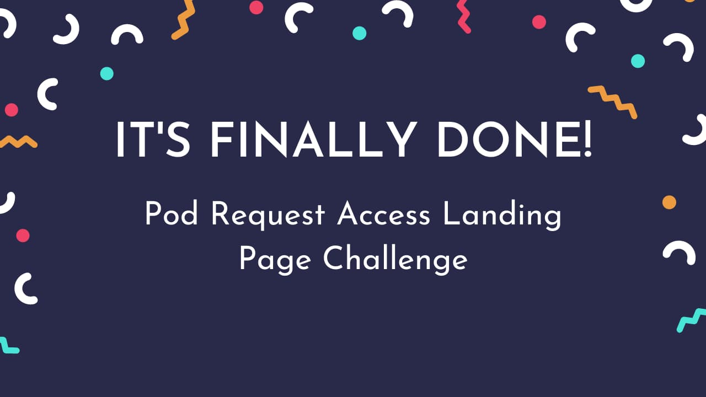
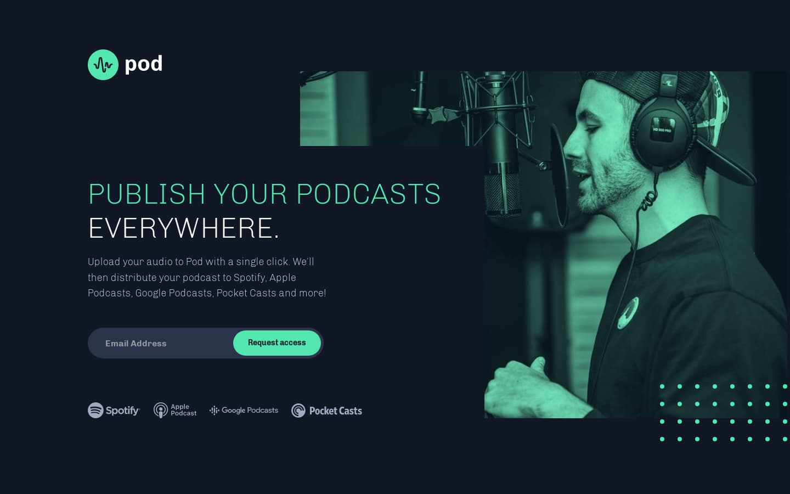
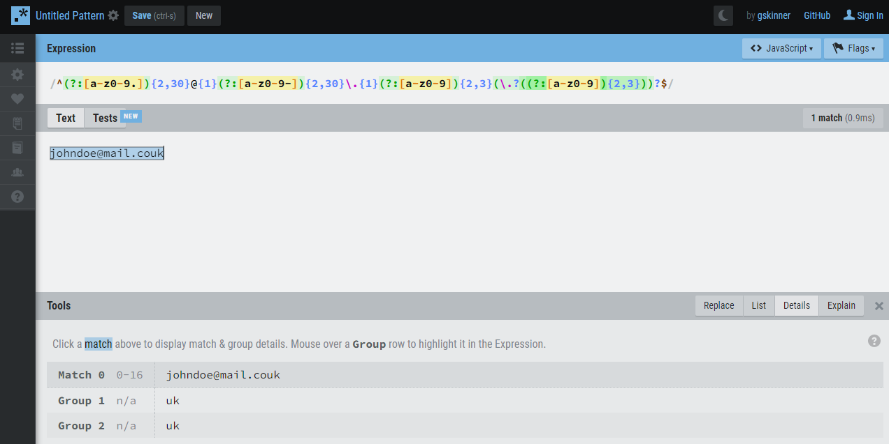
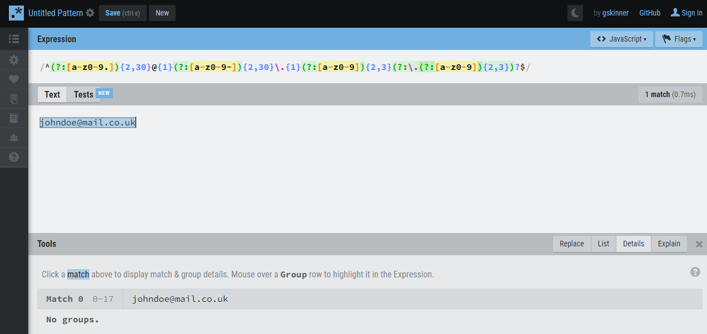
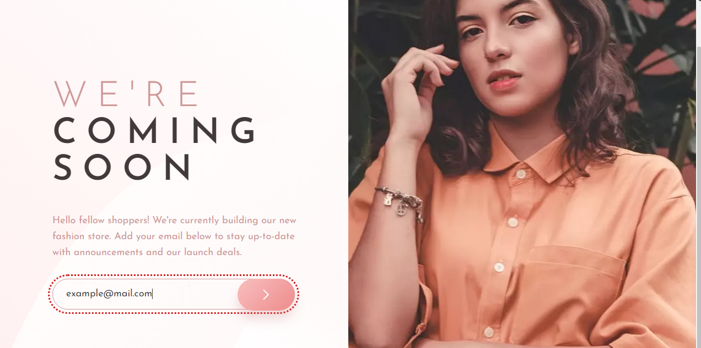
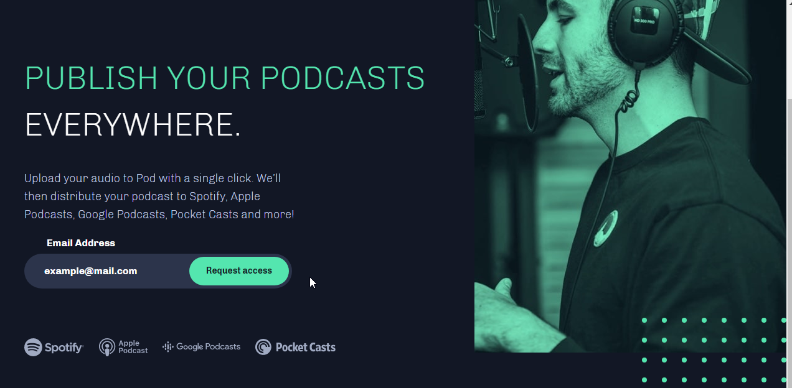

<p align="left">
  <a href="https://www.frontendmentor.io/challenges?difficulties=1" target="_blank"></a>
  
  <a href="https://twitter.com/vanzasetia" target="_blank"></a>
  
  
  
</p>

<p>
  <a href="http://jigsaw.w3.org/css-validator/check/referer">
    
    </a>
    <a href="https://github.com/standard/semistandard">
      
    </a>
</p>

# Pod Request Access Landing Page

## Table of contents
- [Overview](#overview)
  - [Introduction](#introduction)
  - [The challenge](#the-challenge)
  - [Links](#links)
  - [Screenshots](#screenshots)
- [My process](#my-process)
  - [Built with](#built-with)
  - [What I learned](#what-i-learned)
  - [Useful resources](#useful-resources)
- [Author](#author)
- [License](#license)
- [References](#references)

## Overview
[(Back to top)](#table-of-contents)

### Introduction
Welcome to the `README.md` of this repo! The purpose of creating this project is to sharpen my coding skill.

In this file I'm going to tell you everything, starting with the tools that I used, and much more.

That's it for the introduction and **happy reading!**
### The Challenge
The challenge is to build out this early access landing page and get it looking as close to the design as possible.

The users should be able to:

- View the optimal layout depending on their device's screen size
- See hover states for interactive elements
- See visible focus states for interactive elements when navigating by keyboard
- Understand and be able to navigate page content while using assistive technology
- Receive an error message when the form is submitted if:
  - The Email address field is empty should show "Oops! Please add your email"
  - The email is not formatted correctly should show "Oops! Please check your email"

### Links
- [Live Review](https://officialpod.netlify.app/)
- [Frontend Mentor Solution Page](https://www.frontendmentor.io/solutions/pod-request-access-landing-page-html-css-sass-js-regex-OrtBAEY5n)
- [Analytics](https://xjuxlfvnicbwmghj6nq9i7nohixy3y.herokuapp.com/share/EnyuqfqO/officialpod)
- [Privacy Policy](./PRIVACY%20POLICY.md)

### Screenshots



## My Process
[(Back to top)](#table-of-contents)

### Built With
- **Following best practices**\* 
- HTML Semantic Tags
- [BEM (Block, Element, Modifier)](https://sparkbox.com/foundry/bem_by_example) Class *Naming Convention*
- [Sass](https://sass-lang.com/)
- JavaScript
- CSS Flexbox
- Mobile-first workflow
- [Normalize.css](https://necolas.github.io/normalize.css/)

> \* I follow guidelines. [See what guidelines that I follow.](./docs/README.md#guidelines)

### What I Learned

#### Regular Expression

I actually using the Regular Expression (Regex) that is on the [vanzasetia/base-apparel-coming-soon-page](https://github.com/vanzasetia/base-apparel-coming-soon-page). But, before I use the Regex, I notice a bug on it. [(See the issue)](https://github.com/vanzasetia/base-apparel-coming-soon-page/issues/1)

There is a bug where the user can submit an email that has an invalid second top-level domain such as vanzasetia@home.couk, vanzasetia@school.coid, vanzasetia@office.cous, etc. So, I adjust the Regex a bit.

Here is the difference:
```diff
const emailValidation =
-  /^(?:[a-z0-9.]){2,30}@{1}(?:[a-z0-9-]){2,30}\.{1}(?:[a-z0-9]){2,3}(\.?((?:[a-z0-9]){2,3}))?$/;
+  /^(?:[a-z0-9.]){2,30}@{1}(?:[a-z0-9-]){2,30}\.{1}(?:[a-z0-9]){2,3}(?:\.(?:[a-z0-9]){2,3})?$/;
```

Sorry, that I can't explain what's going on. But, if you understand it and want to explain it, feel free to create a pull request or raise an issue.

Anyway, I would try to explain it as best as I can. So, this part of Regex, `(\.?((?:[a-z0-9]){2,3}))?` is actually divided into two groups when it should not.

If you test the old Regex with [RegExr](https://regexr.com/), then use this email johndoe@mail.couk, and after that click the **details** panel, you will see that there are two groups.



So, I changed and wrapped it with a non-capturing group instead, `(?:\.(?:[a-z0-9]){2,3})?`. Now, if you try using the johndoe@mail.couk, it's no longer matches the Regex. As a result, if you use the correct email address, johndoe@mail.co.uk, it's going to match the Regex and there's no more grouping.



#### Ternary Operator for Custom Alert Message

Initially, I was creating a `getAlertMessage()` function to decide that if the input is empty then return `"Oops! Please add your email"`, else then return `"Oops! Please check your email"`.

```javascript
const getAlertMessage = () => {
  if (!heroInput.value) {
    return 'Oops! Please add your email';
  } else {
    return 'Oops! Please check your email';
  }
};
```

Then, I remembered about the shorthand for the `if else`. So, with the ternary operator, I ended up only having one line JavaScript code (if Prettier is not activated 😆).

```javascript
const message =
  isEmailInvalid && heroInput.value
    ? 'Oops! Please check your email'
    : 'Oops! Please add your email';
```
#### Improve the UX

Normally, I always make the `label` disappear after the user starts typing any text.



> For your information, I rarely use a `placeholder` attribute for the placeholder when doing Frontend Mentor challenges. Usually, there's no label in the design, so  I like to make the `label` element as the placeholder instead. Also, every input needs a `label`.

Now, it doesn't disappear! 🙌


### Useful Resources
- [RegExr](https://regexr.com/) - It's an online tool that helps me create and learn about Regular Expression. As a result, I can finish this challenge. Recommended for everyone (including beginners) that learn about Regex! 

## Author
[(Back to top)](#table-of-contents)

- Frontend Mentor - [@vanzasetia](https://frontendmentor.io/profile/vanzasetia)
- Twitter - [@vanzasetia](https://twitter.com/vanzasetia)
- Code Newbie - [@vanzasetia](https://community.codenewbie.org/vanzasetia)
- Want to see me on other platform? [Check my linktree!](https://linktr.ee/vanzasetia)

## License
[(Back to top)](#table-of-contents)

>You can check out [the full license](./LICENSE)

This project is licensed under the terms of the MIT license.

For those who are curious, why do I need to license this?
- First and probably most important, it is free. 😆
- Second, I checked this [Choose license website](https://choosealicense.com/) to help me chose a license.
- The last reason, if I don't want to choose a license, then [here's what gonna happen](https://choosealicense.com/no-permission/).

## References

[(Back to top)](#table-of-contents)

> See the [documentation.](./docs/README.md)
